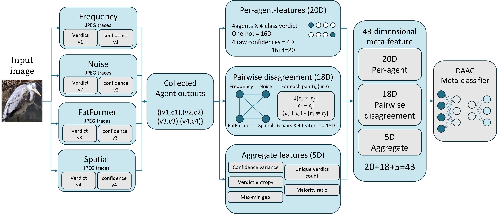
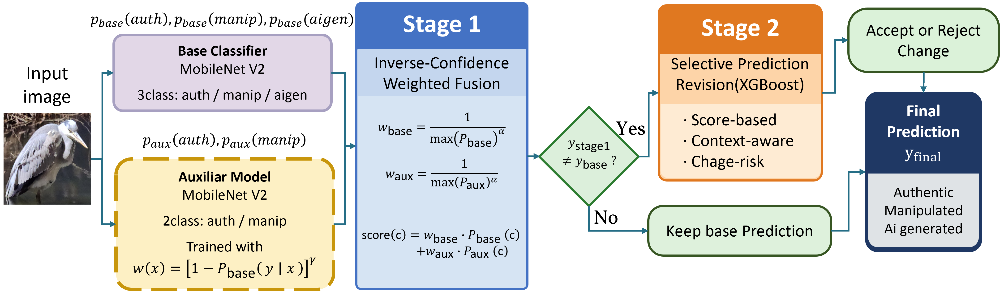
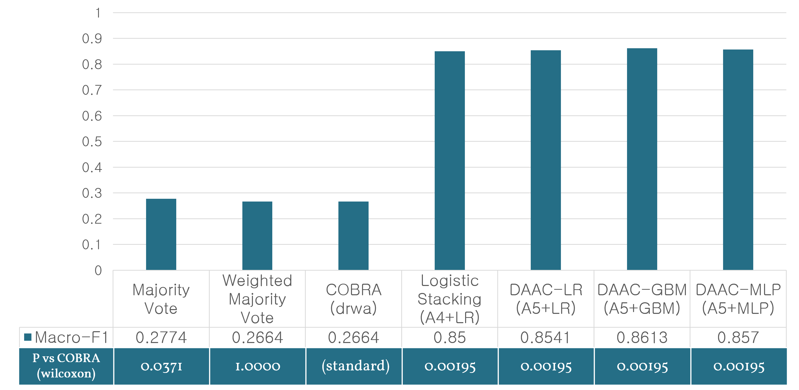
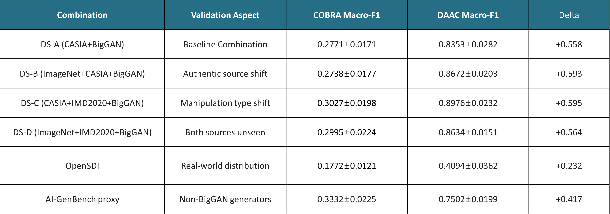
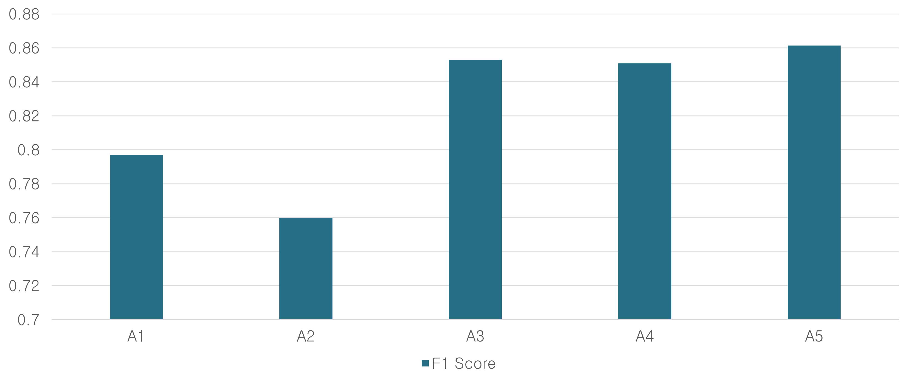
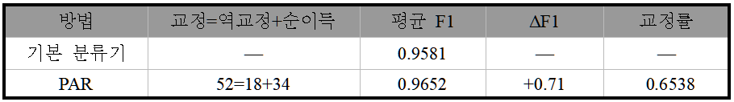
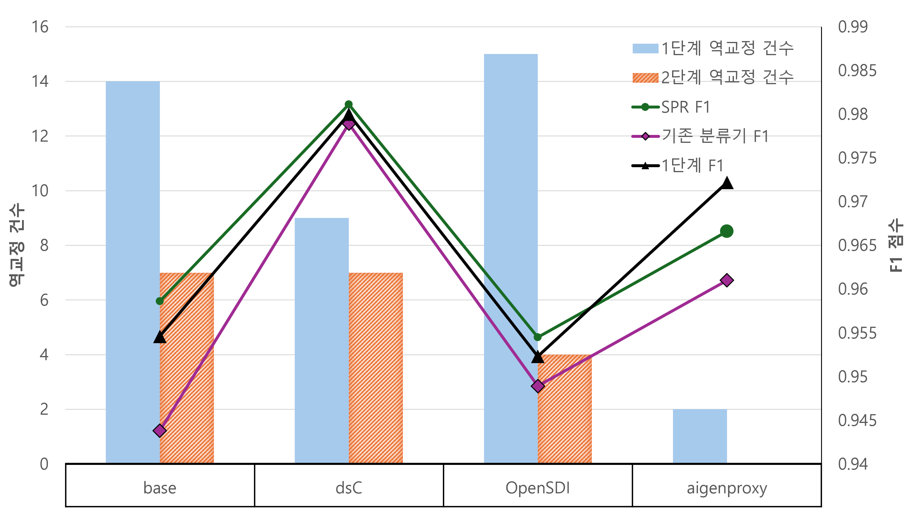
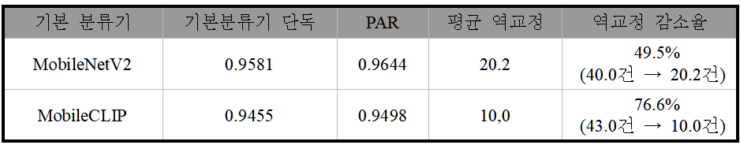
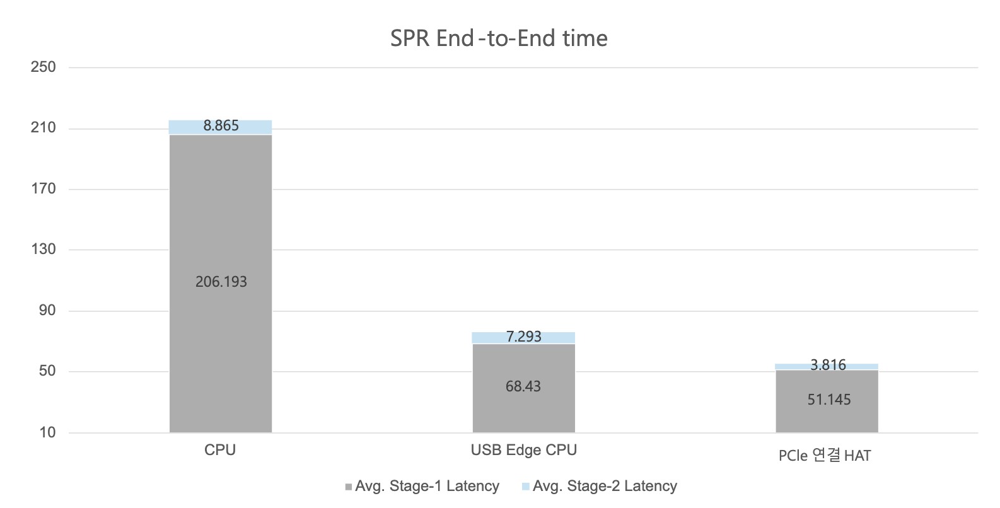

# MAIFS

`MAIFS`는 두 편의 연구를 다시 읽고, 핵심 결과를 검증하고, 필요한 실험을 다시 돌려볼 수 있게 정리한 공개용 연구 저장소입니다. 이 저장소는 raw image dataset, 대형 weight, 외부 서브모듈 전체를 포함하지는 않지만, 논문 PDF, 대표 figure, 결과 캐시, 재현 스크립트, Raspberry Pi 5 측정 자산까지 한곳에서 확인할 수 있도록 구성했습니다.

## 한눈에 보기

| 연구 | 무엇을 다루는가 | 대표 성과 | 논문 |
| --- | --- | --- | --- |
| `DAAC` | 4-agent disagreement-aware consensus를 이용한 서버 측 이미지 위변조 판별 | 반복 검증에서 `DAAC-GBM 0.8613 ± 0.0148` vs `COBRA 0.2664 ± 0.0086` | [DAAC_final_20260318.pdf](docs/research/papers/DAAC_final_20260318.pdf) |
| `PAR` | 경량 2-model 구조와 ARV veto를 이용한 엣지 친화적 판정 수정 | avg macro-F1 `0.9581 -> 0.9652`, 역교정 `40 -> 18` | [PAR_final_20260406.pdf](docs/research/papers/PAR_final_20260406.pdf) |

## 논문과 대표 자료

- DAAC 최종 논문: [docs/research/papers/DAAC_final_20260318.pdf](docs/research/papers/DAAC_final_20260318.pdf)
- PAR 최종 논문: [docs/research/papers/PAR_final_20260406.pdf](docs/research/papers/PAR_final_20260406.pdf)
- PAR 확장 초안과 표/설명: [docs/research/papers/PAPER_DRAFT_ARV_v3.md](docs/research/papers/PAPER_DRAFT_ARV_v3.md)
- 공유 결과 archive: [docs/research/papers/PAPER_DRAFT_ARV_v3_SHARED_RESULTS.tar.gz](docs/research/papers/PAPER_DRAFT_ARV_v3_SHARED_RESULTS.tar.gz)
- 실험 재현 안내: [docs/research/EXPERIMENT_REPRO_RUNBOOK.md](docs/research/EXPERIMENT_REPRO_RUNBOOK.md)

## 연구 소개

### DAAC 연구 소개

`DAAC`는 서버 환경에서 여러 forensic agent의 판단을 단순 다수결로 묶는 대신, `에이전트들 사이의 불일치 패턴` 자체를 학습하는 연구입니다. `frequency`, `noise`, `FatFormer`, `spatial` 네 에이전트가 각각 판정과 신뢰도를 내면, DAAC는 이를 `43-dim 메타 특징`으로 요약한 뒤 `Logistic Regression`, `GBM`, `MLP` 같은 메타 분류기가 최종 클래스를 결정합니다. 핵심 가설은 "정답 신호가 개별 모델 안에만 있는 것이 아니라, 모델들 사이의 충돌 구조에도 있다"는 점입니다.

#### DAAC 아키텍처



위 그림이 DAAC의 실제 아키텍처입니다. 입력 이미지를 `Frequency`, `Noise`, `FatFormer`, `Spatial` 네 에이전트가 각각 보고 `verdict`와 `confidence`를 내면, 이를 `per-agent feature 20D`, `pairwise disagreement 18D`, `aggregate feature 5D`로 묶어 최종 `43-dimensional meta-feature`를 구성하고, 마지막에 `DAAC meta-classifier`가 최종 클래스를 결정합니다. 즉, DAAC의 핵심은 규칙 기반 합의가 아니라 `불일치 구조를 학습하는 메타 분류기`에 있습니다.

### PAR 연구 소개

`PAR`는 DAAC의 통찰을 엣지 환경으로 옮긴 두 번째 연구입니다. 무거운 4-agent 구조를 그대로 쓰기보다, `MobileNetV2` 기반 3-class 기본 분류기와 2-class 보조 모델을 먼저 결합하고, 그 뒤 `ARV`가 판정 변경을 받아들일지 되돌릴지를 선택적으로 결정합니다. 즉 목표는 교정을 무조건 늘리는 것이 아니라, `reverse correction`을 줄이면서 실제 Raspberry Pi 5 같은 장치에도 올릴 수 있는 경량 의사결정 구조를 만드는 것입니다.



위 그림은 PAR 연구의 핵심 구조를 보여줍니다. `Stage 1`은 역신뢰도 가중 결합으로 교정 후보를 만들고, `Stage 2`의 `ARV`는 그 변경이 정말 유익한지 다시 평가합니다. 그래서 PAR의 기여는 단순히 F1을 높이는 데 그치지 않고, "유익한 수정은 살리고 해로운 수정은 막는" 운영 가능한 후단 계층을 만든 데 있습니다.

## 핵심 성과

### DAAC

- 연구 질문: 개별 모델의 출력보다, 모델들 사이의 `불일치 패턴` 자체가 더 강한 일반화 신호가 될 수 있는가?
- 대표 결과: paper-style 반복 검증에서 `DAAC-GBM`은 avg macro-F1 `0.8613 ± 0.0148`을 기록했고, 비교 기준 `COBRA`는 `0.2664 ± 0.0086`에 머물렀습니다.
- 개별 에이전트 대비 이점: 가장 높은 단일 에이전트인 `frequency`도 `0.4284` 수준이어서, 메타 합의 계층의 기여가 뚜렷합니다.
- 포함된 자산: `dsA / dsB / dsC / dsD / OpenSDI / aigenproxy` 경로의 cache 기반 재현 결과와 paper summary JSON이 포함되어 있습니다.

| DAAC 결과 | avg macro-F1 | 비고 |
| --- | ---: | --- |
| `DAAC-GBM` | `0.8613 ± 0.0148` | 10-seed 반복 검증 기준 메인 결과 |
| `COBRA` | `0.2664 ± 0.0086` | 규칙 기반 비교 기준 |
| `Frequency` 단일 에이전트 | `0.4284 ± 0.0107` | 가장 높은 단일 에이전트 |
| `Noise` 단일 에이전트 | `0.3445 ± 0.0150` | 단일 에이전트 비교 |
| `FatFormer` 단일 에이전트 | `0.3385 ± 0.0158` | 단일 에이전트 비교 |
| `Spatial` 단일 에이전트 | `0.3083 ± 0.0114` | 단일 에이전트 비교 |



위 비교 그림은 `Majority Vote`, `Weighted Majority Vote`, `COBRA` 대비 `DAAC-LR`, `DAAC-GBM`, `DAAC-MLP`가 얼마나 큰 폭으로 향상되는지를 한눈에 보여줍니다. README의 숫자 표와 함께 보면, DAAC의 핵심 성과가 "개별 전문가의 단순 집계"를 넘어서 메타 합의 계층이 성능을 끌어올렸다는 점임을 더 직관적으로 확인할 수 있습니다.



이 그림은 `DS-A`, `DS-B`, `DS-C`, `DS-D`뿐 아니라 `OpenSDI`, `AI-GenBench proxy` 같은 외부 분포에서도 DAAC가 `COBRA`보다 일관되게 높은 성능을 보인다는 점을 요약합니다. 즉, DAAC의 강점은 단순히 한 데이터셋에서 잘 맞는 것이 아니라 `source shift`, `manipulation shift`, `real-world distribution shift`가 생겨도 불일치 기반 메타 특징이 꽤 안정적으로 작동한다는 데 있습니다.



이 ablation 그림도 중요합니다. `A1 confidence-only`, `A2 verdict-only`, `A3 disagreement-only`, `A4 verdict+confidence`, `A5 full`을 비교했을 때 최종 `A5 full`이 가장 높게 나오므로, DAAC의 성과는 한 가지 단순 신호만으로 설명되지 않습니다. `개별 판정`, `신뢰도`, `쌍별 불일치`, `집계 특징`이 함께 들어갈 때 가장 좋은 결과가 나온다는 점이 README의 아키텍처 설명과 맞물립니다.

- 대표 결과 파일:
  - [experiments/results/paper_final/paper_final_20260304_141508.json](experiments/results/paper_final/paper_final_20260304_141508.json)
  - [experiments/results/agent_eval/agent_eval_paper_final_20260305_053951.json](experiments/results/agent_eval/agent_eval_paper_final_20260305_053951.json)

### PAR / ARV

- 연구 질문: 무거운 다중 전문가 합의의 통찰을, 엣지 장치에서도 쓸 수 있는 경량 2-model 구조로 줄이면서도 성능 향상을 얻을 수 있는가?
- 메인 결과: 최종 시스템은 기본 분류기 단독 avg macro-F1 `0.9581`을 `0.9652`로 높였고, 1단계 결합에서 생기던 역교정을 `40건 -> 18건`으로 줄였습니다.
- 데이터셋별 의미: `OpenSDI`에서는 F1이 `0.9424 -> 0.9545`로 올라가, 역교정이 많이 발생하는 환경에서 ARV의 가치가 특히 크게 드러났습니다.
- 추가 검증: strong backbone 두 종류를 합친 반복 실험에서 역교정 총합이 평균 `30.2건`으로 줄어 `63.6%` 감소했습니다.
- 통계적 뒷받침: pooled 비교에서 macro-F1은 `0.9562 -> 0.9643`, paired bootstrap 95% CI는 `[0.0045, 0.0117]`, exact McNemar test는 `p=5.8×10^-5`였습니다.

| PAR 결과 | 값 | 비고 |
| --- | ---: | --- |
| 기본 분류기 avg macro-F1 | `0.9581` | MobileNetV2 3-class base |
| 최종 ARV avg macro-F1 | `0.9652` | 메인 결과 |
| 성능 향상 | `+0.0071` | `0.9581 -> 0.9652` |
| 1단계 결합 역교정 | `40` | ARV 적용 전 |
| 최종 ARV 역교정 | `18` | ARV 적용 후 |
| OpenSDI F1 | `0.9424 -> 0.9545` | 데이터셋별 대표 개선 |
| strong backbone 역교정 감소 | `63.6%` | 두 backbone 합산 반복 검증 |



이 표는 README의 PAR 메인 수치를 시각적으로 다시 묶어 둔 요약입니다. 기본 분류기 대비 `PAR`가 평균 F1을 올리면서도, 교정과 역교정의 균형을 더 안전하게 가져간다는 점을 빠르게 전달합니다.



데이터셋별 결과 그림에서는 `OpenSDI`처럼 역교정이 특히 많이 발생하던 환경에서 2단계 구조가 더 큰 가치를 보인다는 점이 드러납니다. 즉, PAR의 장점은 모든 환경에서 무조건 공격적으로 수정하는 것이 아니라, 위험한 수정이 많은 조건에서 더 안정적으로 작동한다는 데 있습니다.



이 표는 `MobileNetV2`뿐 아니라 더 강한 기본 분류기 설정에서도 PAR의 방향성이 유지되는지를 보여줍니다. 특히 역교정 감소율이 `49.5%`, `76.6%`로 나타나, PAR가 단순한 단발 개선이 아니라 "이미 강한 기본 분류기를 더 안전하게 만드는 층"이라는 해석을 뒷받침합니다.

- 대표 결과 문서:
  - [docs/research/papers/PAPER_DRAFT_ARV_v3.md](docs/research/papers/PAPER_DRAFT_ARV_v3.md)
  - [Raspberry_pi5_Experiment/docs/ARV_E2E_ALL_BACKENDS_EXPERIMENT_SUMMARY_20260329.md](Raspberry_pi5_Experiment/docs/ARV_E2E_ALL_BACKENDS_EXPERIMENT_SUMMARY_20260329.md)

### Raspberry Pi 5 온디바이스 성과

- 1단계 ICWMV 기준 평균 총 지연: `CPU 123.72 ms`, `USB Edge TPU 64.56 ms`, `PCIe HAT 54.17 ms`
- 고정 benchmark input 기준 전체 ARV bundle real-path 종단간 지연: `CPU 276.995 ms`, `USB 66.102 ms`, `PCIe 51.388 ms`
- 저장소에는 fixed-input benchmark뿐 아니라 실제 keep/revert 사례를 찾는 active probe workflow도 포함되어 있습니다.



이 지연 그림은 Raspberry Pi 5 배포 관점에서 `CPU`, `USB Edge TPU`, `PCIe 연결 HAT` 경로의 체감 차이를 보여줍니다. 특히 README 본문의 수치와 함께 보면, `PCIe HAT` 경로가 가장 빠르고 엣지 배포 가능성이 가장 높다는 메시지가 훨씬 선명해집니다.

- 관련 자산:
  - [Raspberry_pi5_Experiment/README.md](Raspberry_pi5_Experiment/README.md)
  - [Raspberry_pi5_Experiment/ARV_EndToEnd_RPi5/README.md](Raspberry_pi5_Experiment/ARV_EndToEnd_RPi5/README.md)
  - [docs/research/RPi5_EXPERIMENT_GUIDE.md](docs/research/RPi5_EXPERIMENT_GUIDE.md)

## 이 저장소에 포함된 것

- [experiments/](experiments/)
  - DAAC paper-style rerun, cross-dataset validation, PAR/ARV fusion, MobileCLIP 비교, export 및 보조 분석 스크립트
- [experiments/results/](experiments/results/)
  - DAAC paper summary, agent evaluation, cross-dataset cache, PAR/ARV backbone/specm/veto/repeat cache
- [src/](src/), [configs/](configs/), [deploy/](deploy/)
  - 원 논문 스크립트가 직접 참조하는 연구 코어와 설정
- [Server_Reproduction/DAAC/](Server_Reproduction/DAAC/)
  - 공개용 경량 DAAC 재현 번들
- [Server_Reproduction/ARV/](Server_Reproduction/ARV/)
  - 공개용 PAR 재현 번들과 alpha weighting sweep
- [Raspberry_pi5_Experiment/](Raspberry_pi5_Experiment/)
  - ICWMV 및 ARV의 Raspberry Pi 5 측정 자산
- [datasets/](datasets/)
  - raw image 대신 manifest, split provenance, subset list만 포함
- [docs/research/papers/](docs/research/papers/)
  - 최종 PDF, 초안, figure, 공유 결과 archive

## 빠른 시작

```bash
python3 -m venv .venv
source .venv/bin/activate
pip install -r requirements.txt
pip install -r requirements-optional-tools.txt
```

### DAAC cache-based rerun

```bash
python3 experiments/run_paper_final.py experiments/configs/paper_final_dsA.yaml
python3 experiments/run_agent_eval.py experiments/configs/paper_final.yaml
python3 experiments/run_cross_dataset_validation.py
```

### PAR / ARV server rerun

```bash
cd Server_Reproduction/ARV
pip install -r requirements_arv.txt
python3 run_arv_experiment.py
python3 run_icwmv_weighting_sweep.py
python3 run_arv_generalist.py
python3 run_arv_strong_backbone_repeats.py
python3 run_arv_support_analyses.py
```

### Raspberry Pi 5

```bash
cd Raspberry_pi5_Experiment/ICWMV
bash run_rpi5_latency_benchmark.sh all /path/to/test_image.jpg
```

```bash
cd Raspberry_pi5_Experiment/ARV_EndToEnd_RPi5
bash run_arv_e2e_benchmark.sh all
bash run_arv_active_workflow.sh cpu
```

## 공개본의 경계

- raw dataset과 대용량 zip은 포함하지 않습니다.
- 대형 학습 weight와 외부 서브모듈 전체는 포함하지 않습니다.
- [scripts/prepare_sota_datasets.py](scripts/prepare_sota_datasets.py)와 [datasets/](datasets/) provenance는 포함하지만 실제 이미지 원본은 별도로 준비해야 합니다.
- DAAC의 원래 main base-set table이 사용한 `phase2_patha_scale500_gain_predictor/patha_agent_outputs_20260304_080157.jsonl` cache는 원본 아카이브에도 없었습니다.
- 그래서 저장소에는 당시 summary snapshot은 보존하되, 실제 공개 rerun 엔트리포인트는 현재 남아 있는 cache 기준 설정으로 안내합니다.
- 최신 논문 이름은 `PAR`이지만, 저장소 내부 폴더와 일부 스크립트, 결과물은 기존 실험명 `ARV`를 유지합니다.
