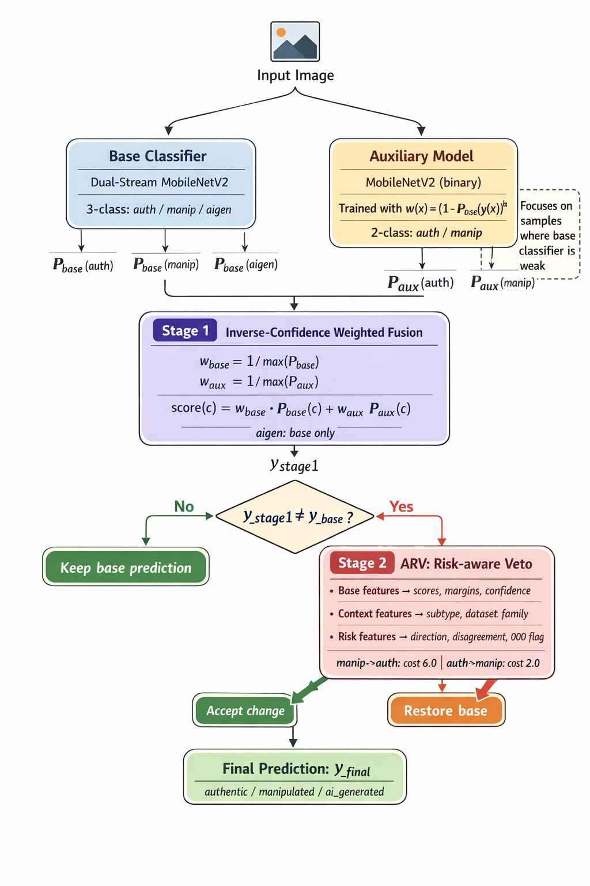

# 비대칭 위험거부 합의를 통한 경량 이미지 위조 탐지: 역교정 억제와 Raspberry Pi 5 배포

> 초안 버전 3.0 | 2026-03-28
> 투고 대상: 한국정보처리학회 (KIPS) 2026

---

## 초록

이미지 위조 탐지는 편집 조작과 AI 생성 이미지가 뒤섞인 환경에서 점점 더 어려운 문제로 변하고 있다. 최근 전쟁 상황의 정보 교란, 딥페이크 악용, 생성형 AI 기반 사기와 같은 사례는 이미지 진위 판별이 서버 측 사후 분석에 머물 수 없고, 기기 내부에서 빠르게 동작하는 경량 구조가 필요함을 보여준다 [6]-[9]. 선행 연구인 DAAC는 다중 전문가 간 불일치 패턴을 학습해 높은 일반화 성능을 보였지만, 전체 구조가 무거워 엣지 장치에 직접 배치하기 어렵다. 본 논문은 이러한 한계를 줄이기 위해, 세 클래스를 판별하는 MobileNetV2 기반 기본 분류기와 원본-조작 이진 판별에 특화된 보조 모델을 결합한 뒤, 해로운 판정 변경만을 선택적으로 되돌리는 ARV(Asymmetric Risk-aware Veto; 비대칭 위험거부 합의)를 제안한다. 먼저 기본 분류기의 이진 오분류를 분석한 결과, 오분류의 74.3%가 신뢰도 0.6을 초과하는 고확신 오류에 해당함을 확인하였다. 이는 신뢰도가 낮은 경우에만 보조 모델을 호출하는 임계값 기반 방식이 구조적으로 많은 오류를 놓친다는 점을 시사한다. 이에 본 논문은 기본 분류기가 약한 샘플에 더 큰 가중치를 두어 보조 모델을 학습하고, 1단계에서는 두 모델을 적극적으로 결합하여 교정 후보를 생성한 뒤, 2단계 ARV에서 방향성, 불일치 강도, 학습 분포와 차이가 큰 평가 환경의 문맥을 이용해 위험한 판정 변경만 억제한다. 네 개 데이터셋 중 하나를 통째로 남겨 시험하는 교차 데이터셋 평가에서 ARV를 포함한 최종 시스템은 기본 분류기 단독의 avg macro-F1 0.9581을 0.9652로 향상시키고, 1단계 결합에서 발생하던 역교정 건수를 40건에서 18건으로 줄였다. 특히 OpenSDI에서는 F1이 0.9424에서 0.9545로 개선되었다. 추가 서버 실험에서 strong backbone 두 종류에 대해 10-seed 반복 평가를 수행한 결과, MobileNetV2 기반 기본 분류기에서는 역교정이 평균 20.2건으로, 미세조정된 MobileCLIP 기반 기본 분류기에서는 평균 10.0건으로 감소하였다. 두 strong backbone을 합치면 역교정 총합은 평균 30.2건으로 줄어 평균 63.6% 감소하였고, 순이득은 평균 44.0건으로 증가하였다. 한편 Raspberry Pi 5의 1단계 기준 구조는 세 가지 backend에서 직접 측정되었으며, 평균 총 지연은 CPU 123.72ms, USB Edge TPU 64.56ms, PCIe 연결 HAT 54.17ms였다. 본 연구는 경량 2-모델 구조의 역교정 문제를 명시적으로 다룬다는 점에서, 엣지 배포용 경량 합의 구조를 한 단계 진전시킨다.

**키워드**: 이미지 위조 탐지, 역교정 억제, 비대칭 위험거부 합의, ARV, 엣지 배포, Raspberry Pi 5

---

## 1. 서론

이미지 위조 탐지는 편집 조작과 AI 생성 이미지가 동시에 확산되는 환경에서 점점 더 어려운 문제가 되고 있다. 최근에는 전쟁 상황의 정보 교란, 딥페이크 악용, 생성형 AI 기반 사기와 같은 피해가 현실화되면서 [6]-[9], 이미지 진위 판별은 단순한 서버 측 사후 분석이 아니라 현장과 단말에서 즉시 대응해야 하는 기술적 과제로 바뀌고 있다.

조작 흔적, 주파수 성분, 생성 모델 고유의 인공 흔적은 서로 다른 표현 공간에 분포하므로, 단일 모델이 모든 유형에 일관되게 강하기는 어렵다. 이러한 이유로 첫 번째 연구인 DAAC는 복수 전문가 간 불일치 패턴을 학습하는 다중 에이전트 합의 구조를 제안하였고, 단일 모델 대비 높은 일반화 성능을 보였다. 그러나 DAAC는 Raspberry Pi 5와 같은 엣지 장치에서 직접 운용하기에는 무겁다. 따라서 두 번째 연구의 핵심 질문은 다음과 같다. 다중 전문가 합의의 철학을 모두 유지할 수는 없더라도, 그 핵심 통찰을 더 가벼운 2-모델 구조로 축소하여 엣지 환경에서도 의미 있는 성능 개선을 얻을 수 있는가?

이 질문에 대한 가장 단순한 해법은 기본 분류기와 보조 모델을 적극적으로 결합하는 것이다. 실제로 이러한 1단계 결합은 많은 오류를 교정한다. 그러나 동시에 새로운 문제가 나타난다. 보조 모델을 강하게 결합하면 기본 분류기가 원래 맞혔던 샘플을 오히려 틀리게 뒤집는 역교정(reverse correction)이 함께 증가한다. 본 연구에서 사용한 기본 분류기를 분석하면, authentic/manipulated 이진 오분류의 74.3%가 신뢰도 0.6을 초과하는 고확신 오류였고, 적극적 1단계 결합은 avg macro-F1을 높이는 대신 역교정을 40건까지 증가시켰다. 즉, 여기서 핵심 과제는 교정 후보를 더 많이 만드는 것이 아니라, 유익한 판정 변경과 해로운 판정 변경을 구분하여 해로운 변경만 억제하는 것이다.

본 논문은 이를 위해 ARV를 제안한다. ARV는 1단계에서 기본 분류기와 보조 모델을 결합해 교정 후보를 만들고, 2단계에서 기본 분류기의 판정을 실제로 바꾸는 후보만 다시 검사한다. 이 위험거부 모듈은 별도의 대형 신경망을 추가 추론하지 않으며, 1단계에서 이미 계산된 점수, 판정 변경 방향, 불일치 강도, 학습 분포와 차이가 큰 평가 환경의 문맥을 이용해 위험한 변경만 선택적으로 되돌린다. 따라서 ARV는 단순한 후처리 규칙이 아니라, 경량 결합 구조의 역교정 문제를 직접 다루는 안전화 계층으로 해석할 수 있다.

본 논문의 주요 기여는 다음과 같다.

1. MobileNetV2 기반 기본 분류기의 고확신 오류 분포를 정량적으로 분석하고, 임계값 기반 개입 방식이 구조적으로 놓치는 영역을 수치로 제시한다.
2. 적극적 1단계 결합과 비대칭 위험거부 2단계로 이루어진 ARV를 제안하고, 방향성·불일치·문맥 정보를 함께 사용하는 경량 위험 추정 구조를 설계한다.
3. 네 개 데이터셋 교차 평가, pooled 통계 검정, 외부 baseline 비교, strong backbone 10-seed 반복 실험을 통해, ARV가 기본 분류기 단독의 avg macro-F1을 0.9581에서 0.9652로 높이고 역교정을 안정적으로 억제함을 보인다.
4. Raspberry Pi 5의 CPU, USB Edge TPU, PCIe 연결 HAT에서 1단계 기준 구조를 직접 측정하고, 추가로 고정 benchmark input에서 ARV 전체 번들의 종단간 지연을 측정하여 현재 주장 가능한 배포 범위를 정직하게 구분한다.

---

## 2. 관련 연구

### 2.1 첫 번째 연구: DAAC

DAAC [1]은 CAT-Net, MVSS-Net, FatFormer, Mesorch의 불일치 패턴을 학습하는 다중 에이전트 합의 구조이다. 이 연구는 개별 모델의 출력보다 모델 간 구조적 충돌 자체가 더 강한 구분 신호가 될 수 있음을 보였고, OpenSDI와 AI-GenBench proxy를 포함한 일반화 평가에서도 유의한 개선을 확인하였다. 본 논문은 DAAC의 핵심 통찰, 즉 모델 간 불일치가 오류 수정의 신호가 될 수 있다는 점을 계승한다. 다만 본 연구의 목표는 서버 측 다중 전문가 구조를 그대로 재현하는 것이 아니라, 이를 엣지 환경의 경량 2-모델 구조에 맞게 단순화하는 데 있다.

### 2.2 신뢰도 보정과 임계값 기반 개입

Guo et al. [4]은 현대 신경망이 높은 정확도를 보이더라도 신뢰도가 잘 보정되어 있지 않을 수 있음을 보였다. 이 결과는 신뢰도가 낮은 샘플에만 보조 모델을 호출하는 임계값 기반 구조가 항상 합리적이지 않을 수 있음을 시사한다. 본 논문의 문제 분석 역시 이 관찰과 직접 맞닿아 있으며, 기본 분류기의 오분류가 고확신 구간에 집중될 경우 단순 임계값 기반 개입은 구조적으로 한계를 가진다.

### 2.3 어려운 샘플 중심 학습

Focal Loss [3]는 쉬운 샘플이 학습을 지배하지 않도록 어려운 샘플의 손실 기여를 상대적으로 키우는 방식을 제안하였다. 본 논문은 이 아이디어를 그대로 복제하지는 않지만, 기본 분류기의 정답 확률을 이용하여 기본 분류기가 약한 샘플에 더 큰 가중치를 부여하는 방식으로 보조 모델을 학습한다. 즉, 보조 모델은 모든 샘플을 균등하게 처리하는 모델이라기보다, 기본 분류기의 취약점을 보완하는 모델로 설계된다.

### 2.4 선택적 분류와 위험 제어

Selective Classification [5]은 분류기가 모든 샘플에 대해 반드시 결정을 내리지 않아도 된다는 관점에서 위험과 커버리지의 균형을 다룬다. ARV는 예측 자체를 보류하는 대신, 1단계 결합이 만들어낸 판정 변경만을 선택적으로 거부한다는 점에서 차이가 있다. 즉 본 논문은 예측 보류보다 판정 변경 보류에 가까운 구조를 제안한다.

### 2.5 엣지 배포용 경량 백본

MobileNetV2 [2]는 모바일 환경에서 정확도와 연산량의 균형을 제공하는 대표적인 경량 백본이다. 본 논문에서 MobileNetV2 계열을 기본 분류기와 보조 모델의 출발점으로 선택한 이유도 여기에 있다. 본 연구의 목적은 최고 성능 자체보다, 배포 가능한 모델 크기와 지연 시간 안에서 성능 개선과 위험 제어를 함께 얻는 경량 구조를 정리하는 것이다.

---

## 3. 문제 분석: 고확신 오류와 역교정 위험

### 3.1 분석 대상과 설정

분석 대상 기본 분류기는 이중 스트림 MobileNetV2 기반 3-class 분류기이며, authentic, manipulated, ai_generated를 판정한다. 고확신 오류와 교정률 분석은 보조 모델의 역할 범위에 맞추기 위해 authentic/manipulated 이진 부분에서 수행하였다. 전체 평가는 base, dsC, OpenSDI, aigenproxy의 네 개 데이터셋에서 수행하였다.

### 3.2 기본 분류기의 고확신 오류

**표 1. 기본 분류기 이진 오분류의 신뢰도 분포**

| 지표 | 값 |
|------|-----|
| 오분류 수 | 144건 |
| 평균 오분류 신뢰도 | 0.7538 |
| 평균 정분류 신뢰도 | 0.9502 |
| 오분류 중 신뢰도 > 0.6 | 107건 (74.3%) |
| 오분류 중 신뢰도 > 0.8 | 67건 (46.5%) |

표 1은 기본 분류기의 오분류가 대체로 낮은 신뢰도 영역에 모여 있지 않음을 보여준다. 오분류의 74.3%가 신뢰도 0.6을 초과하므로, 신뢰도가 낮은 경우에만 보조 모델을 호출하는 방식은 원리적으로 많은 오류에 접근할 수 없다. 예를 들어 신뢰도 0.6을 기준으로 하면, 개입 가능한 오분류는 전체의 25.7%에 그친다.

### 3.3 적극적 교정과 역교정의 동시 발생

이 한계를 넘기 위해 보조 모델을 항상 결합하는 적극적 구조를 사용하면 더 많은 오류를 교정할 수 있다. 실제로 본 논문의 1단계 결합은 교정률 49.2%를 달성하였다. 그러나 그 대가로 역교정도 40건까지 증가하였다. 특히 OpenSDI에서는 순이득이 음수로 바뀌어, 경량 결합 구조가 학습 분포와 차이가 큰 환경에서 안정적으로 작동하지 않음을 확인하였다. 이 관찰은 결합 강도를 단순히 조정하는 것만으로는 충분하지 않으며, 판정 변경 자체의 위험을 직접 추정하는 후단 메커니즘이 필요함을 시사한다.

---

## 4. 제안 방법: ARV

### 4.1 전체 구조

ARV는 두 단계로 이루어진 최종 시스템이다. 1단계는 기본 분류기와 보조 모델을 결합해 교정 후보를 생성하는 단계이고, 2단계는 그중 기본 분류기의 원래 판정을 실제로 바꾸는 후보만 다시 점검하는 위험거부 단계이다.

*그림 1. 제안하는 ARV의 전체 구조. 기본 분류기와 보조 모델이 입력 이미지를 병렬로 추론하고, 1단계 적극 결합이 교정 후보를 생성한다. 이후 1단계 결과가 기본 분류기의 원래 판정을 실제로 바꾸는 경우에만 2단계 ARV가 동작하여, 해당 변경을 유지하거나 기본 판정으로 복귀시킨다.*

그림 1에서 보듯이 입력 이미지는 먼저 기본 분류기와 보조 모델로 동시에 전달된다. 두 모델의 출력은 1단계에서 적극적으로 결합되어 `y_stage1`을 만든다. 이어서 `y_stage1`이 기본 분류기의 원래 판정을 바꾸지 않는 경우에는 그 결과를 그대로 사용하고, 기본 판정을 바꾸는 경우에만 2단계 ARV가 동작하여 해당 변경을 유지할지 또는 기본 판정으로 되돌릴지를 결정한다. 본 논문에서 비교의 최종 대상은 이 전체 구조이다. 즉 메인 결과는 `기본 분류기 단독`과 `ARV를 포함한 최종 시스템`의 비교로 제시하고, 1단계 결합만 적용한 경우는 내부 ablation으로 다룬다.

### 4.2 기본 분류기가 약한 샘플 중심의 보조 모델 학습

보조 모델은 MobileNetV2 기반 이진 분류기이며, 기본 분류기의 정답 확률을 이용해 샘플 가중치를 설정한다.

식 (1)은 보조 모델의 가중 손실 함수이고, 식 (2)는 각 샘플의 가중치 정의이다.

식 (1)  
$$L = \frac{1}{N}\sum_i w(x_i)\,\mathrm{CE}(f_{\text{aux}}(x_i), y_i)$$

식 (2)  
$$w(x_i) = \left(1 - P_{\text{base}}(y_i \mid x_i)\right)^{\gamma}$$

여기서 `P_base(y_i | x_i)`는 기본 분류기가 정답 클래스에 부여한 확률이다. 따라서 기본 분류기가 이미 잘 이해하고 있는 샘플보다, 기본 분류기가 헷갈려하는 샘플이 더 큰 가중치를 갖는다. 본 논문의 주 실험에 사용한 설정은 `γ=1`이며, temperature scaling을 적용하지 않은 보조 모델이다.

### 4.3 1단계: 두 모델의 적극 결합

추론 단계에서는 기본 분류기와 보조 모델의 출력을 직접 평균하지 않고, 각 모델의 최대 확률에 역비례하는 가중치를 둔다. 이를 일반화하면 역신뢰도 가중의 강도는 `α`로 조절할 수 있다. 목적은 어느 한 모델의 과도한 확신이 결과를 완전히 지배하지 않도록 하는 데 있다.

식 (3), 식 (4)는 기본 분류기와 보조 모델의 가중치이고, 식 (5)부터 식 (7)까지는 최종 결합 점수이다.

식 (3)  
$$w_{\text{base}} = \frac{1}{\max(P_{\text{base}})^{\alpha}}$$

식 (4)  
$$w_{\text{aux}} = \frac{1}{\max(P_{\text{aux}})^{\alpha}}$$

식 (5)  
$$\operatorname{score}(\text{auth}) = w_{\text{base}}P_{\text{base}}(\text{auth}) + w_{\text{aux}}P_{\text{aux}}(\text{auth})$$

식 (6)  
$$\operatorname{score}(\text{manip}) = w_{\text{base}}P_{\text{base}}(\text{manip}) + w_{\text{aux}}P_{\text{aux}}(\text{manip})$$

식 (7)  
$$\operatorname{score}(\text{aigen}) = w_{\text{base}}P_{\text{base}}(\text{aigen})$$

`ai_generated` 클래스는 보조 모델이 다루지 않으므로 기본 분류기만이 담당한다. 본 논문의 메인 ARV 결과는 `α=1.0`을 기준으로 수행하였고, 더 강한 역신뢰도 가중 설정인 `α=1.5`에 대한 비교는 6.5절에서 별도로 다룬다. 1단계의 역할은 가능한 한 많은 유익한 교정 후보를 만드는 것이다. 반대로, 해로운 변경을 억제하는 역할은 2단계 ARV가 맡는다.

### 4.4 2단계: 비대칭 위험거부 모듈

ARV의 핵심은 2단계 위험거부 모듈이다. 이 모듈은 기본 분류기와 1단계 결과가 다른 샘플, 즉 최종 판정이 원래 판정을 바꾸려는 경우에만 동작한다. 역할은 단순하다. 해당 판정 변경을 유지할지(`keep`) 또는 기본 분류기 판정으로 되돌릴지(`revert`)를 결정한다.

본 논문에서 위험거부 모듈은 depth-2 XGBoost 메타 분류기로 구현하였다. 입력 특징은 세 그룹으로 구성된다.

| 특징 그룹 | 설명 |
|----------|------|
| 기본 결합 특징 | 기본 분류기, 보조 모델, 1단계 결과의 점수와 점수 차이, 신뢰도, 가중치 비율 |
| 문맥 특징 | 세부 유형 표식과 계열 문맥 표식 |
| 위험 확장 특징 | 마진, 신뢰도 차이, 신뢰도 곱, 판정 변경 방향, 학습 분포와 다른 환경 표식 |

ARV가 점수 정보만 보는 단순 거부기와 구별되는 핵심은 두 가지다. 첫째, 판정 변경의 방향을 명시적으로 표현한다. 예를 들어 조작 이미지를 원본 이미지로 바꾸는 경우와 그 반대 경우를 서로 다른 위험으로 본다. 둘째, 동일한 점수 차이라도 학습 분포와 차이가 큰 환경에서 더 위험할 수 있다는 점을 문맥 특징으로 반영한다.

### 4.5 비대칭 비용 학습

역교정은 방향에 따라 위험도가 다르다. 본 연구에서는 조작 이미지를 원본 이미지로 바꾸는 오류가 더 심각하다고 보고, 이를 학습 비용에 직접 반영하였다. 또한 학습 분포와 차이가 큰 환경에서 발생한 해로운 판정 변경에는 추가 가중치를 부여하였다.

대표 비용은 다음과 같다.

- 조작 이미지를 원본 이미지로 바꾸는 역교정: `6.0`
- 원본 이미지를 조작 이미지로 바꾸는 역교정: `2.0`
- 학습 분포와 차이가 큰 환경의 해로운 역교정 추가 가중치: `× 1.5`

따라서 ARV는 평균 정확도를 다시 최적화하는 모델이라기보다, 판정 변경의 위험을 선택적으로 걸러내는 안전화 계층에 가깝다.

### 4.6 평가 지표

본 논문은 일반적인 macro-F1 외에 교정과 역교정의 균형을 함께 본다.

- 교정률: `교정 건수 / 기존 오류 수`
- 역교정 건수: `기존 정답을 뒤집어 틀린 샘플 수`
- 순이득: `교정 건수 - 역교정 건수`

이때 기존 오류 수는 authentic/manipulated 이진 부분에서의 기본 분류기 오분류 수이며, ai_generated는 제외한다.

---

## 5. 실험 설정

평가는 base, dsC, OpenSDI, aigenproxy의 네 데이터셋에서 수행하였다. 매번 한 데이터셋을 통째로 테스트셋으로 남기고, 나머지 세 개 데이터셋으로 보조 모델과 위험거부 모듈을 학습한 뒤 남겨 둔 데이터셋에서 평가하였다. 이 방식은 특정 데이터셋에만 맞춘 성능이 아니라, 새로운 데이터셋에 대한 일반화 성능을 보기 위한 것이다.

비교 대상은 다음과 같다.

1. 기본 분류기 단독
2. 단순 softmax 평균 앙상블
3. logistic stacking
4. 신뢰도 임계값 기반 보수적 결합 방식(τ=0.6)
5. 1단계 결합만 적용
6. 점수 정보만 사용하는 단순 거부기
7. 문맥 정보를 일부 추가한 초기형 거부기
8. ARV

메인 결과 표에서는 `기본 분류기 단독`과 `ARV를 포함한 최종 시스템`의 차이를 우선 제시한다. 나머지 방법들은 ARV의 구성 요소가 실제로 어떤 역할을 하는지 설명하기 위한 ablation으로 제시한다.

---

## 6. 실험 결과

### 6.1 메인 결과: 기본 분류기 대비 ARV 최종 시스템

**표 2. 기본 분류기 단독과 ARV 최종 시스템의 비교**

| 방법 | avg F1 | ΔF1 | 교정률 | 역교정 건수 | 순이득 |
|------|--------|-----|--------|-------------|--------|
| 기본 분류기 단독 | 0.9581 | — | — | — | — |
| ARV를 포함한 최종 시스템 | 0.9652 | +0.71%p | 0.3735 | 18 | 8.5 |

표 2는 ARV를 포함한 최종 시스템이 기본 분류기 단독보다 명확히 높은 평균 성능을 보인다는 점을 보여준다. 이 표가 본 논문의 메인 비교다. 즉 ARV는 기존 시스템에 마지막에 덧붙인 부가 장치가 아니라, 경량 2-모델 구조를 실제 운영 가능한 시스템으로 만들기 위한 최종 의사결정 계층으로 해석되어야 한다. 추가로 네 데이터셋 4200개 샘플을 합친 pooled 비교에서 기본 분류기와 ARV의 macro-F1은 0.9562에서 0.9643으로 상승했고, 2000회 paired bootstrap의 Δmacro-F1 95% 신뢰구간은 `[0.0045, 0.0117]`로 0을 넘었다. 또한 exact McNemar test에서도 `b=18`, `c=52`, `p=5.8×10^-5`로 유의한 차이를 보였다. 따라서 메인 개선은 단발 수치에 그치지 않고, 샘플 수준 통계 검정에서도 같은 방향으로 지지된다.

### 6.2 외부 baseline과 내부 ablation 비교

**표 3. 외부 baseline과 내부 구성 비교**

| 방법 | avg F1 | 교정률 | 역교정 건수 | 순이득 |
|------|--------|--------|-------------|--------|
| 단순 softmax 평균 앙상블 | 0.9579 | 0.5313 | 66 | 1.75 |
| logistic stacking | 0.9630 | 0.2439 | 10 | 3.75 |
| 신뢰도 임계값 기반 보수적 결합 방식(τ=0.6) | 0.9612 | — | — | — |
| 1단계 결합만 적용 | 0.9630 | 0.4921 | 40 | 6.5 |
| 점수 정보만 사용하는 단순 거부기 | 0.9622 | 0.3996 | 33 | 6.0 |
| 문맥 정보를 일부 추가한 초기형 거부기 | 0.9625 | 0.4044 | 31 | 6.0 |
| ARV | 0.9652 | 0.3735 | 18 | 8.5 |

표 3은 ARV의 이득이 내부 ablation에만 국한되지 않음을 보여준다. 단순 softmax 평균 앙상블은 교정률이 0.5313으로 가장 높지만 역교정이 66건까지 증가해 순이득이 1.75에 머문다. logistic stacking은 역교정을 10건으로 낮추지만 교정 자체가 크게 줄어 순이득이 3.75에 그친다. 반면 ARV는 평균 F1과 순이득이 모두 가장 높다. 즉 ARV의 강점은 결합을 약하게 만들어 안전성만 확보하는 것이 아니라, 유익한 판정 변경은 최대한 유지하면서 해로운 변경을 더 선택적으로 제거하는 데 있다.

### 6.3 데이터셋별 결과

**표 4. 데이터셋별 1단계 결합과 ARV 비교**

| 데이터셋 | 1단계 결합 F1 | 1단계 역교정률 | ARV F1 | ARV 역교정률 | ΔF1 |
|---------|---------------|---------------|--------|-------------|-----|
| base | 0.9586 | 1.53% | 0.9586 | 0.76% | +0.0000 |
| dsC | 0.9789 | 1.55% | 0.9811 | 1.20% | +0.0022 |
| OpenSDI | 0.9424 | 2.65% | 0.9545 | 0.71% | +0.0121 |
| aigenproxy | 0.9722 | 0.35% | 0.9666 | 0.00% | -0.0056 |
| 평균 | 0.9630 | 1.52% | 0.9652 | 0.68% | +0.0022 |

표 4의 역교정률은 각 데이터셋에서 기본 분류기가 원래 맞혔던 authentic/manipulated 이진 샘플 중, 최종 시스템이 오히려 틀리게 뒤집은 비율을 의미한다. 가장 큰 변화는 OpenSDI에서 나타난다. 1단계 결합만 적용한 경우 OpenSDI에서는 역교정률이 2.65%까지 증가하고 순이득도 음수로 바뀐다. 반면 ARV를 적용하면 이 값이 0.71%로 낮아지고 F1이 0.9545로 상승한다. 이는 ARV의 주요 이득이 모든 데이터셋에서 균일하게 발생한다기보다, 학습 분포와 차이가 큰 환경에서 역교정을 억제하는 방향으로 나타남을 보여준다.

base 데이터셋에서는 F1이 0.9586으로 동일하지만, 내부 구성은 달라진다. 1단계 결합은 `36`건을 교정하는 대신 `14`건의 역교정을 만들었고, ARV는 교정 건수를 `29`건으로 줄이는 대신 역교정을 `7`건으로 절반으로 낮췄다. 즉 base에서는 유익한 교정 감소와 해로운 역교정 감소가 거의 정확히 상쇄되어 F1은 같고, ARV는 더 안전한 운영 지점을 제공한 셈이다.

aigenproxy는 ARV의 현재 한계를 가장 분명하게 보여주는 사례다. 1단계 결합은 `12`건 교정, `2`건 역교정으로 순이득 `10`을 만들었지만, ARV는 `5`건 교정, `0`건 역교정으로 순이득 `5`에 그쳤다. 세부적으로 보면 ARV는 해로운 역교정 `2`건을 없애는 대신, `authentic→manipulated`의 유익한 교정 `5`건과 `manipulated→authentic`의 유익한 교정 `2`건까지 함께 되돌렸다. 즉 aigenproxy에서는 ARV가 과보수적으로 작동하여 유익한 변경도 지나치게 억제하는 경향이 있다.

### 6.4 기본 분류기 확장성: MobileCLIP 추가 서버 실험과 반복 검증

ARV가 특정 기본 분류기에서만 유효한지 확인하기 위해, Raspberry Pi 실험과는 별도로 서버 환경에서 MobileCLIP 기반 기본 분류기 두 종류에 대해서도 동일한 ARV 구조를 추가로 평가하였다. 하나는 미세조정을 거친 `MobileCLIP-ft4 strong`이고, 다른 하나는 추가 학습 없이 사용하는 `MobileCLIP zero-shot weak`이다. 특히 strong backbone에 대해서는 단발 결과에 그치지 않고 10개의 random seed로 반복 실험을 수행하여 역교정 감소가 안정적으로 재현되는지 추가로 확인하였다.

**표 5. strong backbone 반복 실험을 포함한 기본 분류기 확장성 평가**

| 기본 분류기 | 기본 분류기 단독 | 1단계 결합 | ARV | 역교정 감소율 | 해석 |
|------------|------------------|-----------|-----|--------------|------|
| MobileNetV2 기반 기본 분류기(성능 높은 설정, 10-seed) | 0.9581 | 0.9630 | 0.9644 | 49.5% | ARV가 안정적으로 우수 |
| MobileCLIP 기반 기본 분류기(미세조정 적용, 10-seed) | 0.9455 | 0.9460 | 0.9498 | 76.7% | ARV가 안정적으로 우수 |
| MobileCLIP 기반 기본 분류기(추가 학습 없이 사용, 단발) | 0.2699 | 0.4655 | 0.4582 | `13.8%` | 1단계 결합이 더 우수 |

표 5는 ARV의 유효 범위가 모든 기본 분류기에서 동일하지 않음을 보여준다. 성능이 충분히 확보된 MobileNetV2와 미세조정된 MobileCLIP에서는 seed를 바꾸어도 ARV가 가장 높은 F1을 유지하면서 역교정을 크게 줄인다. 반면 추가 학습 없이 사용하는 매우 약한 MobileCLIP에서는 ARV가 역교정을 줄이긴 하지만, 유익한 판정 변경까지 함께 줄여 1단계 결합보다 낮은 F1을 보인다.

표 5의 감소율은 1단계 결합에서 발생한 역교정 건수를 기준으로, ARV가 그 수를 얼마나 줄였는지를 퍼센트로 나타낸 값이다. 10-seed 반복 실험에서 strong backbone 두 종류를 합쳐 보면 ARV의 메시지는 더 분명해진다. 1단계 결합만 적용했을 때 strong backbone 두 종류에서 발생한 역교정 총합은 항상 83건이었지만, ARV를 적용하면 평균 30.2건으로 감소한다. 이는 평균 63.6% 감소에 해당한다. 동시에 총 순이득은 평균 44.0건으로 증가한다. 즉 ARV는 범용 성능 부스터라기보다, 이미 일정 수준의 성능을 확보한 기본 분류기를 안전화하는 계층으로 해석하는 것이 타당하다.

### 6.5 역신뢰도 가중 강도 비교 (`α=1.0` vs `α=1.5`)

역신뢰도 가중의 강도가 최종 결과에 미치는 영향을 보기 위해, 기본 설정인 `α=1.0`과 더 강한 가중인 `α=1.5`를 추가 서버 실험으로 비교하였다. 먼저 1단계 ICWMV만 보면 `α=1.5`는 avg macro-F1을 `0.9630`에서 `0.9645`로 높이고, 평균 순이득도 `6.5`에서 `7.25`로 늘렸다. 즉 더 강한 역신뢰도 가중은 1단계 결합 자체에는 도움이 되었다.

그러나 전체 ARV 파이프라인까지 다시 실행해 보면 결과는 달랐다. `scalar veto` 단계는 avg macro-F1이 `0.9622`에서 `0.9634`로, `meta warmstart` 단계는 `0.9625`에서 `0.9645`로 개선되었지만, 최종 `richer veto` 단계에서는 avg macro-F1이 오히려 `0.9652`에서 `0.9637`로 감소했다. 평균 순이득도 `8.5`에서 `6.25`로 줄었고, 평균 교정률 역시 `0.3735`에서 `0.3277`로 낮아졌다. 데이터셋별로 보면 `dsC`와 `aigenproxy`에서는 소폭 개선이 있었지만, `base`는 `0.9586`에서 `0.9526`으로, `OpenSDI`는 `0.9545`에서 `0.9500`으로 하락하였다.

이 결과는 더 강한 역신뢰도 가중이 1단계 교정 후보를 만들 때는 유리할 수 있지만, 최종 ARV의 richer veto까지 포함한 전체 구조에서는 반드시 최적이 되지 않음을 보여준다. 따라서 본 논문은 최종 메인 결과의 기준 설정으로 `α=1.0`을 유지하고, `α=1.5`는 stronger weighting의 representative comparison으로만 제시한다.

### 6.6 비대칭 비용 민감도와 특징 중요도

현재의 비대칭 비용 비율이 임의적인 선택처럼 보이지 않도록, `manipulated→authentic`와 `authentic→manipulated`의 비용 비율을 `2:1`, `3:1`, `4:1`, `6:1`로 바꾸는 소규모 민감도 재실험을 수행하였다. 그 결과 `2:1`에서는 avg F1이 `0.9647`로 가장 높았고, 반대로 `6:1`에서는 총 역교정이 `18`건으로 가장 낮았다. 즉 비용 비율을 더 공격적으로 키울수록 안전성은 좋아지지만 교정률과 순이득은 다소 감소하는 경향이 나타났다. 본 논문의 `6.0 : 2.0` 설정은 이러한 정확도-안전성 사이의 절충점을 선택한 것이다.

평균 gain 기준 특징 중요도를 보면, 가장 큰 기여를 한 특징은 `OOD 조작 계열 표식 (0.0947)`, `신뢰도 비율 (0.0782)`, `OpenSDI partial fake 세부 유형 (0.0762)`, `보조 모델-기본 분류기 마진 차이 (0.0563)`, `신뢰도 차이 (0.0537)`였다. 이는 ARV가 단일 점수 하나보다도, 신뢰도 관계와 학습 분포 바깥의 문맥, 그리고 두 모델 간 불일치 강도를 함께 이용할 때 가장 효과적으로 동작함을 보여준다. 즉 4.4절에서 정의한 `문맥 특징`과 `위험 확장 특징`이 실제로도 핵심 역할을 한다.

### 6.7 해석

본 논문의 결과는 두 가지 점을 분명히 한다.

1. `기본 분류기 -> ARV 최종 시스템`의 비교에서는 성능 개선이 명확하다.
2. 그 개선의 핵심 원천은 단순한 교정 증가가 아니라, 1단계 결합이 만들어낸 해로운 판정 변경을 줄이는 데 있다.

따라서 ARV의 기여는 “조금 더 높은 F1” 그 자체보다, 역교정을 직접 통제하면서 경량 결합 구조의 운영 지점을 더 안전하게 만든다는 데 있다. 특히 pooled bootstrap과 exact McNemar test가 메인 개선을 지지하고, strong backbone 반복 실험에서도 같은 방향의 감소가 재현된다는 점은 ARV의 역할이 우연한 단발 개선이 아니라는 해석을 뒷받침한다. 동시에 aigenproxy와 같은 사례에서는 유익한 변경까지 되돌리는 과보수성이 나타나므로, 향후 연구는 위험 억제와 유익한 교정 보존 사이의 균형을 더 세밀하게 맞추는 방향으로 진행될 필요가 있다.

---

## 7. Raspberry Pi 5 배포 결과와 현재 범위

### 7.1 현재 측정 범위

온디바이스 실측은 두 종류로 확보되어 있다. 첫째, 기본 분류기와 보조 모델, 그리고 두 모델의 고정 결합 규칙까지를 포함한 1단계 기준 구조의 평균 지연을 CPU, USB Edge TPU, PCIe 연결 HAT에서 직접 측정하였다. 둘째, 별도로 패키징한 `ARV_EndToEnd_RPi5` 번들에서 고정 benchmark input 하나를 사용해 ARV 전체 구조의 종단간 지연도 측정하였다. 다만 이 입력에서는 네 개 ARV stage-2 모델이 모두 `ai_lock`으로 종료되었기 때문에, 현재 확보된 종단간 실측은 ARV의 `ai_lock` 경로를 대표하는 값으로 해석해야 한다.

### 7.2 Raspberry Pi 5 실측

독립적으로 재패키징한 두 개의 측정 번들에서 동일한 `paper_v2` 프로토콜(threads=4, warmup=0, runs=10)로 1단계 기준 구조를 측정하였고, 표 6에는 CPU, USB Edge TPU, PCIe 연결 HAT의 평균값을 정리하였다.

**표 6. Raspberry Pi 5에서의 1단계 기준 구조 평균 레이턴시**

| 단계 | CPU (ONNX) | USB Edge TPU | PCIe 연결 HAT |
|------|------------|--------------|---------------|
| 기본 분류기 | 76.16ms | 29.64ms | 23.49ms |
| 보조 모델 | 47.56ms | 34.92ms | 30.69ms |
| 총 지연 | 123.72ms | 64.56ms | 54.17ms |

CPU 경로는 동적 INT8 ONNX Runtime을 사용했고, USB Edge TPU와 PCIe 연결 HAT 경로는 Edge TPU용 TFLite 모델을 사용하였다. 보조 모델은 Edge TPU 위임 가능 레이어 비율이 낮아 가속 폭이 기본 분류기보다 작지만, 전체적으로는 Edge TPU 계열 경로가 CPU보다 유의하게 낮은 총 지연을 보였다. 특히 PCIe 연결 HAT 경로는 평균 총 지연 54.17ms로 가장 빠른 backend였다.

### 7.3 고정 benchmark input에서의 ARV 종단간 측정

`ARV_EndToEnd_RPi5` 번들을 이용해 동일한 `paper_v2` 프로토콜로 고정 benchmark input을 반복 측정한 결과는 표 7과 같다. 이 실험에서는 네 개 ARV stage-2 모델이 모두 `ai_lock -> ai_generated`로 종료되었기 때문에, `real-path`와 `forced-stage2` 지연이 동일하게 나왔고 stage-2 추가 지연은 `0.0ms`로 기록되었다.

**표 7. Raspberry Pi 5에서의 ARV 전체 번들 종단간 레이턴시 (`benchmark_input.png`, ai\_lock 경로)**

| Backend | Avg real-path E2E | Avg forced-stage2 E2E | Avg stage-2 total | Final action |
|---------|------------------:|----------------------:|------------------:|--------------|
| CPU | 276.995ms | 276.995ms | 0.0ms | `ai_lock -> ai_generated` |
| USB Edge TPU | 66.102ms | 66.102ms | 0.0ms | `ai_lock -> ai_generated` |
| PCIe 연결 HAT | 51.388ms | 51.388ms | 0.0ms | `ai_lock -> ai_generated` |

이 결과는 현재 패키징된 ARV 전체 번들이 적어도 `ai_lock` 경로에서는 CPU, USB Edge TPU, PCIe 연결 HAT에서 안정적으로 동작함을 보여준다. 또한 PCIe 연결 HAT이 이 경로에서도 가장 낮은 종단간 지연을 보였고, USB Edge TPU가 그 뒤를 이었다.

### 7.4 해석 범위

따라서 본 논문에서 직접 주장할 수 있는 온디바이스 결과는 두 수준으로 나뉜다. 첫째, 1단계 기준 구조에 대해서는 CPU, USB Edge TPU, PCIe 연결 HAT의 평균 지연을 일반적인 측정값으로 제시할 수 있다. 둘째, ARV 전체 구조에 대해서는 현재 고정 benchmark input에서의 `ai_lock` 경로 종단간 지연을 직접 제시할 수 있다. 반면, ARV가 실제로 `keep` 또는 `revert` 결정을 수행하는 경로의 추가 지연은 아직 충분히 측정되지 않았으므로, 2단계 전체 구조의 일반적 지연을 완전히 대표한다고 주장해서는 안 된다.

---

## 8. 논의

ARV는 새로운 분류기라기보다, 적극적 결합이 만들어낸 판정 변경을 다시 점검하는 위험 추정기로 보는 편이 정확하다. 이 관점에서 ARV의 목표는 전체 정확도를 다시 학습하는 것이 아니라, 교정과 역교정의 비대칭 비용을 반영하여 해로운 판정 변경을 더 많이 제거하는 데 있다. 실제로 ARV의 평균 F1 증분은 크지 않지만, 역교정 감소 폭은 훨씬 크다. 이는 본 방법의 기여가 단순 정확도 향상보다 역교정 통제에 있음을 보여준다.

또한 ARV의 이득은 모든 상황에서 동일하게 나타나지 않는다. OpenSDI처럼 학습 분포와 차이가 큰 환경에서는 분명한 개선이 나타나지만, aigenproxy에서는 F1이 소폭 감소한다. 따라서 ARV는 모든 데이터셋에서 일방적으로 더 좋은 구조라기보다, 역교정이 집중되는 환경에서 더 큰 가치를 갖는 안전화 계층으로 이해하는 것이 적절하다.

마지막으로 온디바이스 관점에서 ARV는 단계 수를 늘리지만, 추가되는 계산은 대형 신경망이 아니라 경량 메타 분류기다. 본 연구는 1단계 기준 구조에 대해 CPU, USB Edge TPU, PCIe 연결 HAT의 실측값을 확보했고, 추가로 고정 benchmark input에서 ARV 전체 번들의 종단간 지연도 측정하였다. 다만 현재 종단간 결과는 모두 `ai_lock`으로 종료된 경우에 해당하므로, keep/revert가 실제로 발동하는 경로의 일반적 지연까지 모두 대표한다고 보기는 어렵다. 이는 ARV를 메인 주제로 다루더라도, 현재 확보된 실험 범위 안에서만 주장하기 위한 의도적 제한이다.

---

## 9. 결론

본 논문은 경량 2-모델 이미지 위조 탐지 구조에서 발생하는 역교정 문제를 다루기 위해 ARV를 제안하였다. 기본 분류기의 고확신 오류 분석은 임계값 기반 개입이 구조적으로 제한적임을 보여주었고, 적극적 1단계 결합은 높은 교정률과 함께 큰 역교정 건수를 초래하였다. ARV는 이러한 상황에서 판정 변경 후보만을 대상으로 방향성, 불일치 강도, 학습 분포와 차이가 큰 평가 환경의 문맥을 이용한 비대칭 위험거부를 수행한다.

실험 결과, ARV를 포함한 최종 시스템은 기본 분류기 단독의 avg macro-F1 0.9581을 0.9652로 향상시켰고, 1단계 결합에서 발생하던 역교정 건수를 40건에서 18건으로 줄였다. pooled sample-level 비교에서도 macro-F1은 0.9562에서 0.9643으로 상승했고, 2000회 paired bootstrap 95% 신뢰구간은 `[0.0045, 0.0117]`, exact McNemar test는 `p=5.8×10^-5`로 유의하였다. 또한 단순 softmax 평균 앙상블과 logistic stacking 같은 외부 baseline보다도 ARV가 더 높은 평균 F1과 순이득을 보였다. 추가 서버 실험에서 역신뢰도 가중 강도를 `α=1.0`과 `α=1.5`로 비교한 결과, 더 강한 가중은 1단계 ICWMV와 meta warmstart에는 유리했지만 최종 richer veto에서는 `0.9652`를 `0.9637`로 낮추었으므로, 본 논문은 최종 메인 설정으로 `α=1.0`을 유지한다. 또한 strong backbone 반복 검증에서는 미세조정된 MobileCLIP 기반 기본 분류기에서도 ARV가 가장 높은 F1을 보였고, strong backbone 두 종류를 합친 경우 역교정 총합은 평균 30.2건으로 줄어 평균 63.6% 감소하였다. 반면 aigenproxy에서는 유익한 변경까지 함께 되돌리는 과보수성이 남아 있다. Raspberry Pi 5에서는 1단계 기준 구조의 평균 총 지연이 CPU 123.72ms, USB Edge TPU 64.56ms, PCIe 연결 HAT 54.17ms였고, 고정 benchmark input에서 측정한 ARV 전체 번들의 real-path 종단간 지연은 CPU 276.995ms, USB 66.102ms, PCIe 51.388ms였다. 다만 현재 ARV 종단간 결과는 `ai_lock` 경로에 한정되므로, keep/revert가 실제로 발동하는 일반적 2단계 지연은 향후 더 보완될 필요가 있다.

향후 연구에서는 첫째, Raspberry Pi 5에서 keep/revert가 실제로 발동하는 경로의 추가 지연을 더 체계적으로 측정하고, 둘째, CPU, USB Edge TPU, PCIe 연결 HAT 환경에서 ARV 추가 비용을 입력 유형별로 비교하며, 셋째, 다양한 기본 분류기와 다양한 역신뢰도 가중 강도에서 ARV의 유효 범위를 더 체계적으로 분석할 계획이다.

---

## 참고문헌

[1] (저자 일동), "다중 에이전트 이미지 위조 탐지에서 불일치 패턴 기반 합의 개선," *한국정보처리학회 논문지*, 2026. [원고 준비 중; 제출 시 저자·권호 정보 갱신]

[2] Sandler, M., Howard, A., Zhu, M., Zhmoginov, A., and Chen, L.-C., "MobileNetV2: Inverted Residuals and Linear Bottlenecks," *CVPR*, 2018.

[3] Lin, T.-Y. et al., "Focal Loss for Dense Object Detection," *ICCV*, 2017.

[4] Guo, C. et al., "On Calibration of Modern Neural Networks," *ICML*, 2017.

[5] Geifman, Y. and El-Yaniv, R., "Selective Classification for Deep Neural Networks," *NeurIPS*, 2017.

[6] Associated Press, "Israel-Hamas war: Here are the facts as misinformation spreads," 2023.

[7] Associated Press, "'All Eyes on Rafah': What is the viral social media trend?," 2024.

[8] FBI Internet Crime Complaint Center, "Malicious Actors Manipulating Photos and Videos to Create Explicit Content and Sextortion Schemes," 2023.

[9] FBI Internet Crime Complaint Center, "Criminals Use Generative Artificial Intelligence to Facilitate Financial Fraud," 2024.
